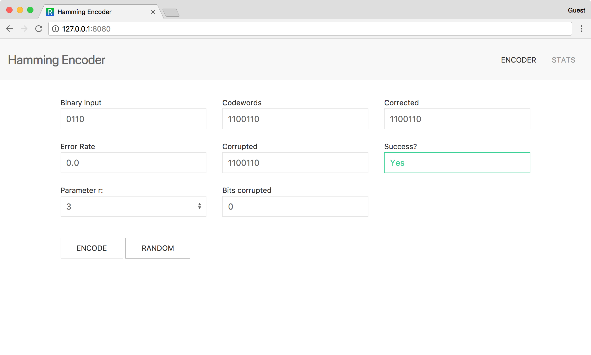

# Hamming Code Web App

This is an implementation of Hamming codes using Python and NumPy, packaged into a web application with Flask. 



It is available online at <https://rminami.pythonanywhere.com/> (if I haven't forgotten to keep it online).

## Installation

To run the application locally on your machine, first download it with 

```sh
$ git clone https://github.com/ryosukeminami/Hamming-Code-App.git
$ cd Hamming-Code-App/
```

It is recommended that you set up a virtual environment for this application. After making sure [virtualenv](https://virtualenv.pypa.io/) is installed, run

```sh
$ virtualenv venv
$ source venv/bin/activate
$ pip3 install -r requirements.txt
```

Now that all of the dependencies have been installed, run the application with

```sh
$ cd hamming_app/
$ python3 flask_app.py
```

Have fun!

## Usage

The user interface should be fairly self explanatory. Type a binary number into the 'binary input' text box and see how Hamming codes handle it. Additionally, you can click the random button to generate a random binary number. 


The stats window shows how the metrics change with different values of r. As r grows larger, the data ratio improves, but the checkers' ability to correct errors decreases. 


## License

MIT License (c) 2017 Ryosuke Minami. Details available in the [./LICENSE](./LICENSE) file.
